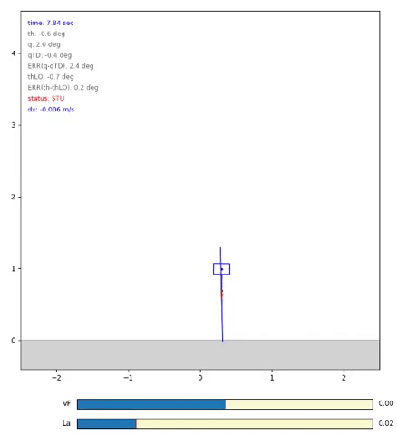

### A python simulation of a raibert style hopping controller.

Achieved forward velocity control and vertical height control. 

Demonstration for forward velocity control is here:

vf stands for forward velocity. 
la controls the jump height. 

### Reference:

Hopping in legged systems — Modeling and simulation for the two-dimensional one-legged case

Marc H. Raibert
Department of Computer Science and The Robotics Institute, Carnegie Mellon University, Pittsburgh, PA, USA
